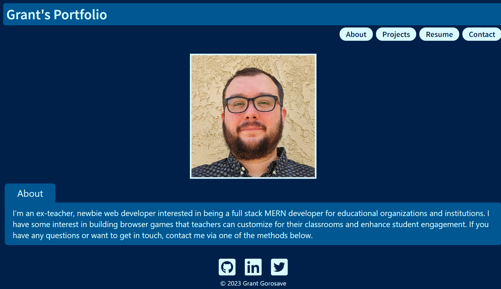

# Grant's Web Portfolio (v2)

## Description
This is a portfolio that showcases my past and current projects. I built it using [React](https://reactjs.org/docs), [Tailwind](https://tailwindcss.com/docs), JavaScript, and CSS. The webisite is responsive for phones, tablets, and desktop computers. I will be adding a backend to this portfolio in the near future.

### Deployed Application

[My Portfolio](https://www.grantgorosave.com/)

## License

This project is licensed under the 	[MIT](https://github.com/ggorosave/grantg-portfolio-v2/blob/main/LICENSE) license.

## Questions

If you have any questions about the repo, contact me at [ggorosave@gmail.com](mailto:ggorosave@gmail.com). Find more of my work at [ggorosave](https://https://github.com/ggorosave).